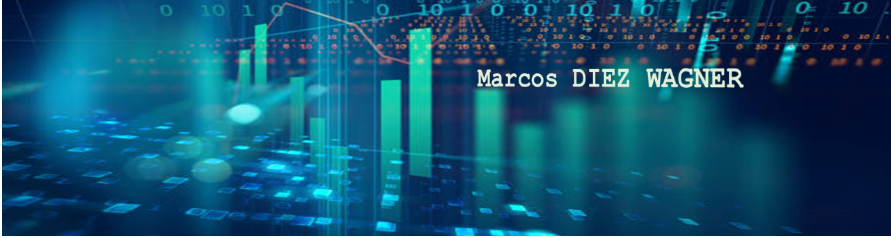

   

  

# Marcos Diez Wagner
 *Matemático* 

Matemático, com 8 anos de experiência em condução de aulas e elaboração de conteúdo, aprimorei minha comunicação e capacidade analítica ao conduzir resoluções para desafios do dia-a-dia. Hoje estou em uma formação em ciência de dados e busco uma oportunidade de atuar como cientista de dados para contribuir com minhas habilidades e entregar melhores resultados.

**Background in:** Python |  Power BI | SQL

**Links:**
* [LinkedIn](https://www.linkedin.com/in/marcos-diez-wagner)

## Projetos Desenvolvidos:
Veja abaixo meu portfólio desenvolvido durante minha jornada de desenvolvimento:

* **Power BI** - Dashboard Overview Vendas 
* **SQL** - Principais funcionalidades para edição, consulta e manipulação de dados
* **Projetos Analíticos**:
